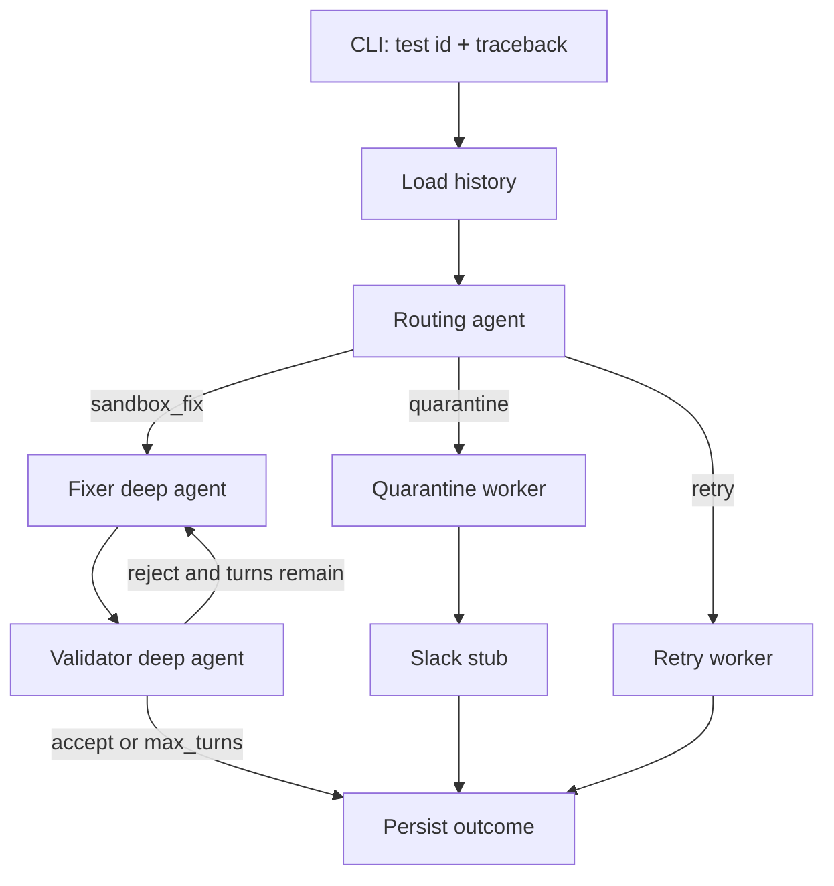

# Triedge

Triedge is a local, multi-agent workflow that triages **failed unit tests**. A
LangGraph routing agent loads prior-failure memory for a test and routes it to
exactly one of three actions:

1. **sandbox_fix** — a bounded Deep Agents *fixer + validator* loop proposes a
   real product-code fix in an isolated sandbox. The fixer may not edit the test
   or hardcode a pass; the validator enforces both rules and the loop is capped
   by `--max-turns`.
2. **quarantine** — the test has failed many times back-to-back; add a
   `@pytest.mark.quarantine` marker in a sandbox and flag the writer in Slack.
3. **retry** — history says the test is just flaky; re-run it.



See [spec.md](spec.md) for the full design.

## Install

```bash
python3 -m venv .venv
source .venv/bin/activate
pip install -r requirements.txt
# Optional, only for the live LLM path:
pip install langchain-openai      # then export OPENAI_API_KEY=...
# or: pip install langchain-anthropic  # then export ANTHROPIC_API_KEY=...
```

Triedge runs with **no API key** using deterministic routing and a dry-run
sandbox, so you can try it immediately.

## Usage

```bash
python main.py route \
  --test "tests/test_calculator.py::test_add" \
  --traceback-file examples/traces/calculator_assertion.txt \
  --repo examples/sample_project

python main.py show-history --test "tests/test_calculator.py::test_add" \
  --history-file examples/history/quarantine_seed.json
```

Key flags for `route`:

| Flag | Meaning |
|------|---------|
| `--test` | Test id as `path::nodeid` (required) |
| `--traceback` / `--traceback-file` | The failure traceback (or pipe via stdin) |
| `--history-file` | JSON file to seed/persist failure history |
| `--repo` | Repo root for git blame / sandboxing (default: cwd) |
| `--max-turns` | Cap on the sandbox fixer/validator loop (default 8, or `TRIEDGE_MAX_TURNS`) |
| `--quarantine-threshold` | Consecutive failures that trigger quarantine (clamped 10–20) |
| `--json` | Emit JSON instead of a formatted report |

## Examples

Runnable end-to-end examples with real failing tests and traces live in
[examples/](examples/README.md) — one per route (sandbox_fix, quarantine,
retry), plus a reproducible buggy sample project.

## How it works

- **Router** ([triedge/router.py](triedge/router.py)) — LLM structured output
  with a deterministic rule fallback (quarantine > retry > sandbox_fix).
- **Signals** ([triedge/tools/git_blame.py](triedge/tools/git_blame.py)) — real
  `git blame` on the traceback frames plus a "risky PR" heuristic.
- **Sandbox loop** ([triedge/agents/sandbox.py](triedge/agents/sandbox.py)) —
  `create_deep_agent` with `fixer` and `validator` subagents on a
  `LocalShellBackend` rooted at an isolated worktree; bounded by
  `ModelCallLimitMiddleware(run_limit=max_turns)` plus a recursion ceiling.
- **Store** ([triedge/store.py](triedge/store.py)) — in-memory failure history
  (streak, flakiness, prior decisions) with optional JSON persistence.

## Limitations (v1)

Local only: no live Slack, CI webhooks, Docker isolation, or auto-merge of
accepted fixes. The validator's re-run needs `pytest` installed in the target
repo's environment. LLM self-reports can be inaccurate, so Triedge relies on the
actual git diff and a structural test-mutation check rather than model claims.
